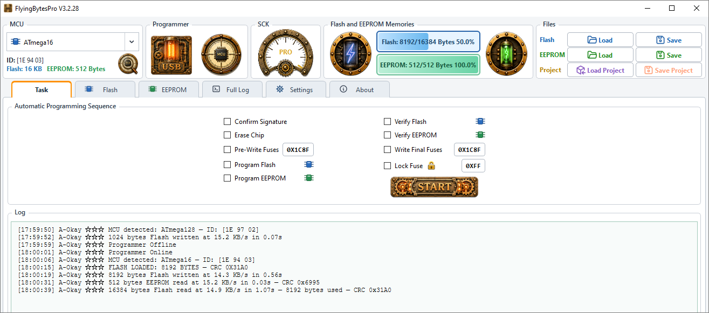
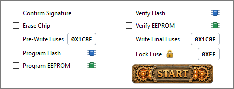
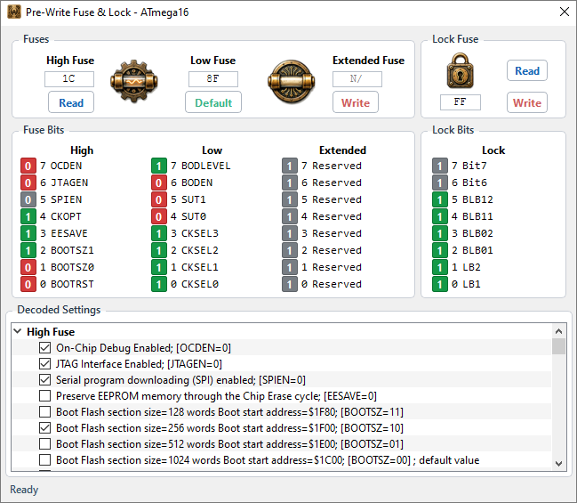
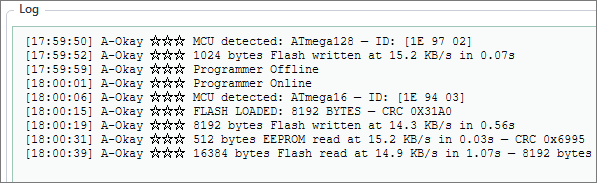
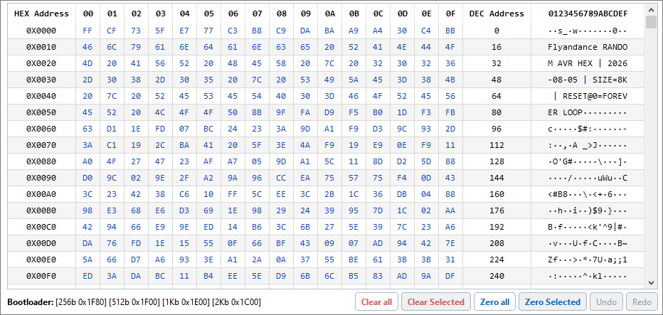
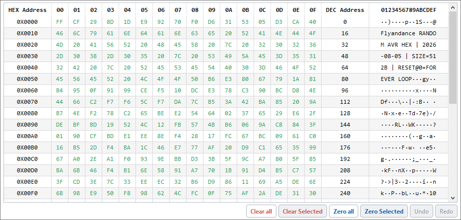
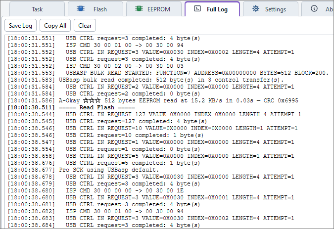
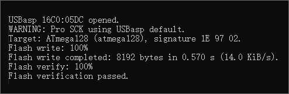
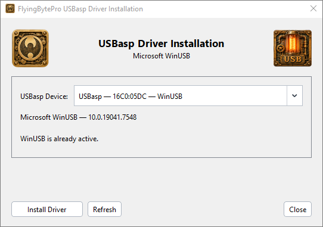

<!-- Copyright (C) 2026 Flyandance JZ - GPL-3.0-or-later -->

# FlyingBytesPro

### A full-featured programmer for classic AVR — visual, fast, and built for real hardware work.

**FlyingBytesPro** is a modern Windows programmer for 8-bit AVR microcontrollers using a USBasp uploader. It combines a highly polished Qt 6 interface with a native direct-libusb programming backend, editable Flash and EEPROM memory views, fuse and lock controls, automatic programming tasks, verification tools, project files, and an AVRDUDE-style command-line programmer.

It is designed for the whole workflow: auto identify the MCU, load or edit firmware, configure fuses, program memory, verify the result, and keep enough low-level visibility to diagnose real hardware when something does not behave as expected. Essentially, this is a high quality tool for beginners and advanced users alike, and it can be used as a referencing tool for configuring an AVR MCU.
 

  

## One application for the complete AVR programming workflow

FlyingBytesPro is meant to feel useful immediately: choose or auto-detect an MCU, load firmware, select the work you want done, and program. When you need more control, the same application opens up into a full memory editor, fuse/lock tool, diagnostic log, and direct command-line programmer.

The interface is organized around the jobs you actually perform rather than around protocol details. The sections below show the main workflow and provide image slots for project screenshots.

## Task — build a complete programming job and run it once

The **Task** view is the fastest way to turn a collection of programming steps into one repeatable operation. Select only the stages you need — signature confirmation, chip erase, pre-write fuse setup, Flash and EEPROM programming, verification, final fuse programming, and lock fuse programming — then start the sequence from one place.

The task engine keeps the order predictable and lets each memory operation use the same device, SCK, verification, and safety rules as the rest of the application. It is useful for one-off programming, repeated bench work, and small production runs where the sequence should be explicit instead of hidden behind a single opaque "program" command.

The large Start control and paired task columns keep the workflow easy to scan without turning the screen into a long list of advanced options. The workflow then can be saved into a project file, and reloaded instantly from that file.
 

## Fuse & Lock — configure the MCU with context, not guesswork

The **Fuse & Lock** window gives device-specific fuse controls where decoder metadata is available, while still preserving access to raw masked values when a device does not have a decoded presentation.

The selected MCU is shown directly in the window title, so there is no ambiguity about which device is being configured. Read and Write actions are separated clearly, reserved bits are preserved through the device masks, and programmed fuse/lock values are verified by readback.

For devices with boot-section fuse definitions, FlyingBytesPro can also interpret the bootloader configuration and connect it to the Flash memory view. This makes fuse setup and memory layout part of the same workflow instead of two unrelated tasks.
 

## Mini Log — one compact line that grows with the job

The **Mini Log** is designed for the information you want to see at a glance. An automatic task run owns one line, and that same line is extended as meaningful stages finish instead of filling the interface with low-level traffic.

A completed run can summarize Flash programming, verification, EEPROM work, fuse actions, and elapsed time in a single readable result. Previous runs remain visible until you clear them, making the Mini Log useful as a quick programming history while the Full Log remains available for detailed diagnostics.

Typical result lines are intentionally concise, for example:

`[13:44:06] A-Okay ☆☆☆ [Flash 512 B written + verified] [EEPROM 32 B written + verified] completed in 2.01s.`
 

## Flash Memory — inspect, edit, read, write, and understand the layout

The **Flash** view is a real memory workspace, not just a file picker. It presents HEX Address, sixteen byte columns, DEC Address, and ASCII together in a compact fixed-width table. Bytes can be edited directly, printable ASCII can be changed in place, and edits preserve both byte values and the sparse defined/undefined state used by the programmer.

FlyingBytesPro supports **Smart Read** for fast application reads and **Full MCU Read** when you need the complete Flash address space, including bootloaders located above erased gaps. Trailing erased space is cleaned from the loaded image automatically so a mostly empty MCU does not look like a completely full firmware image.

For MCUs with supported boot-section fuse metadata, the button row shows the available bootloader sizes and start addresses. When the final fuse configuration enables the bootloader, the relevant address cells are highlighted so the boot region is visible directly in the memory map.

Undo/Redo, clear/zero operations, Intel HEX and raw binary loading/saving, verification, blank checking, and sparse programming all work from the same memory model.
 

## EEPROM Memory — edit data safely and program by real device boundaries

The **EEPROM** view uses the same direct, editable memory-table approach as Flash, making configuration bytes, calibration data, serial data, and small persistent datasets easy to inspect and modify before programming.

EEPROM programming is kept separate from Flash behavior. Writes are isolated to the selected MCU's actual EEPROM page boundaries, verification uses the same defined-byte model as the editor, and fixed slow-SCK operation is handled conservatively for USBasp hardware that needs very low programming clocks.

Because Flash and EEPROM use independent buffers, files, progress, verification, and task selections, you can program either memory by itself or combine both into one automatic sequence.
 

## Full Log — detailed visibility when hardware needs an explanation

The **Full Log** exposes what the programmer is actually doing. Main operations are grouped with clear separators, while USB control transfers, USBasp memory transfers, ISP commands, SCK selection, device responses, retries, and result messages remain available underneath.

Normal diagnostic text stays visually neutral and errors stand out in red. The goal is readability without hiding the low-level information that matters when a cable, target clock, USBasp firmware, fuse setting, or transfer path behaves differently from expected.

This is especially useful when comparing programming speeds, checking slow-SCK behavior, confirming signature reads, or diagnosing a failure that would otherwise appear only as a generic "programming failed" message.
 

## GUI and CLI — use whichever fits the job

**FlyingBytesPro.exe** provides the complete graphical programmer, memory editor, fuse/lock tools, task workflow, projects, and logs.

**FlyingBytesProCLI.exe** provides an AVRDUDE-style direct USBasp command line using the same native programming backend. It is useful for scripts, repeatable command-line workflows, build systems, and users who want the same device database and programming engine without opening the GUI. It's the most basic, but speed tested on my USBasp mod is decent. The simplicity of FlyingBytesProCLI.exe makes it a lot easier to understand USBasp protocol. 

Both interfaces talk to USBasp through libusb directly.

 

## USBasp Driver — install WinUSB directly from FlyingBytesPro

The **USBasp Driver** feature adds a built-in Windows driver installer under **Settings > Install Driver > USBasp**. It detects supported USBasp devices and installs the Microsoft **WinUSB** driver directly from FlyingBytesPro, so a separate driver utility is not needed for normal setup.

FlyingBytesPro itself continues to run as a normal desktop application. When Windows requires elevated permission to install the driver, only the internal driver-install helper requests UAC elevation, installs WinUSB for the selected USBasp, and then returns control to the normal application.

The required libwdi support is bundled with the project under `resources/libwdi`, so the normal Windows build uses the included driver-install resources instead of downloading or rebuilding them.
 

## Built for real USBasp behavior

FlyingBytesPro was developed around the behavior of actual USBasp hardware rather than treating the programmer as a generic black box. The backend includes queue-safe Flash transfers, EEPROM page isolation, required-only long addressing, transient USB retries, post-write ISP-session recovery, explicit readback verification, sparse-image verification, clock-aware slow-SCK handling, and support for memories extending beyond 64 KiB.

The result is a programmer that remains approachable at the UI level while still exposing the details needed for serious AVR work.

## License

FlyingBytesPro is free software licensed under **GNU GPL-3.0-or-later**. See `LICENSE`. Third-party components retain their own licenses as documented in `THIRD_PARTY_NOTICES.md`.

## Highlights

- **175 supported AVR microcontrollers:** 167 classic SPI-ISP devices plus 8 USBasp TPI devices.
- Native USBasp programming through **libusb** — no AVRDUDE wrapper behind the GUI.
- Full graphical programmer plus an **AVRDUDE-style CLI** using the same backend.
- Flash and EEPROM **read, write, verify, and blank-check** operations.
- **Smart Read** and **Full MCU Read** modes for Flash, including high-address bootloader coverage.
- Editable HEX/ASCII Flash and EEPROM buffers with sparse defined-byte tracking and Undo/Redo.
- Intel HEX and raw binary file support.
- Device-aware **fuse and lock programming** with masking and readback verification.
- Bootloader fuse interpretation with supported boot-size/start-address display where decoder metadata is available.
- Configurable automatic programming sequences for repeatable jobs.
- Portable `.fbp` project files for device, clock, memory, fuse, lock, and task state.
- **Auto SCK** scanning, fixed SCK choices down to very slow programming rates, and Pro mode for the USBasp firmware default.
- Queue-safe high-speed Flash programming and EEPROM writes isolated to the MCU's real EEPROM page boundaries.
- Required long-address handling for AVR Flash above 64 KiB.
- Automatic MCU signature detection with explicit selection for shared-signature devices.
- GUI display languages for English, Simplified Chinese, Spanish, Japanese, German, Korean, French, and Vietnamese.
- CRC-16 memory identification and detailed USB/ISP diagnostics.
- GPL-3.0-or-later source intended to be studied, modified, and improved.

## Buy Me a Coffee

If FlyingBytesPro saves you time, helps keep an AVR project alive, or simply makes USBasp programming more pleasant, you can support continued development here:

