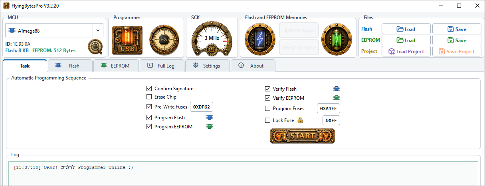
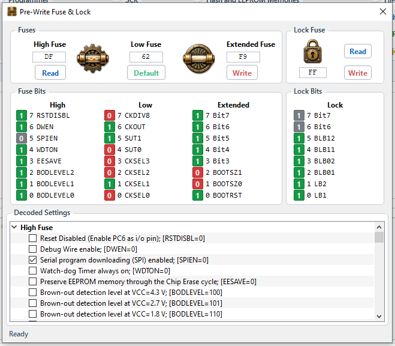

<!-- Copyright (C) 2026 Flyandance JZ - GPL-3.0-or-later -->

## FlyingBytesPro: AVR MCU full Feature Programmer Software

**FlyingBytesPro** is a modern Windows USBasp programmer for 8-bit AVR microcontrollers through classic SPI ISP and USBasp TPI. It combines a focused Qt 6 interface, a completely rewritten direct-libusb programming backend, editable Flash/EEPROM memory views, fuse and lock control, automatic programming sequences, and an AVRDUDE-style command-line programmer.

Built for people who still enjoy making classic AVR hardware do useful things.

 

  

## Highlights

- **Supports 175 AVR microcontrollers: 167 classic SPI-ISP devices plus 8 TPI devices.**
- Sophisticated and beautiful GUI with a simple, focused design.
- Display-language support for English (default), Simplified Chinese, Spanish, Japanese, German, Korean, French, and Vietnamese; language packs affect GUI presentation only, not programmer logic or project/protocol data.
- AVRDUDE-style command-line interface using the USBasp protocol.
- Automatic MCU detection using device-signature bytes; when an identical trailing-`A` alias exists, detection prefers the corresponding non-`A` base MCU while the `A` device remains manually selectable.
- Family-aware MCU ordering keeps related ATmega models together and sorts the major groups from smaller to larger (for example ATmega88 before ATmega128, with ATmega128A directly grouped with ATmega128).
- Completely rewritten backend for direct USBasp programming through libusb — no AVRDUDE wrapper.
- Flash and EEPROM reading, writing, verification, and blank checking.
- Smart and Full MCU Flash-read modes with automatic trailing-`0xFF` cleanup, so erased tail space is not counted as loaded firmware.
- Configurable automatic programming sequences and portable project files.
- Editable hexadecimal and ASCII memory buffers with compact centered memory tables, fixed HEX Address/byte/DEC Address/ASCII columns, center-aligned ASCII display, no unused gap before the vertical scrollbar, Clear all/Clear Selected, Zero all/Zero Selected, and fully undoable/redoable edits.
- Intel HEX and raw binary file loading and saving.
- True Auto SCK scanning from the fastest supported rate downward, plus a Pro mode that uses the USBasp firmware default clock request.
- Fuse and lock-byte reading with masked, readback-verified programming and compact illustrated fuse controls with blue Read and IndianRed Write actions.
- Supplied steampunk artwork is used for the main Start control and programmer/fuse status controls with borderless image-button interaction.
- CRC-16 memory identification and detailed low-level operation logging.
- Queue-safe high-speed Flash programming tuned for custom USBasp firmware.
- EEPROM writes isolated to the target MCU's actual EEPROM page boundaries.
- Long-address support for AVR memories extending beyond 64 KiB.
- GPL-3.0-or-later open-source code intended to be studied, changed, and improved.

## Two ways to program

**FlyingBytesPro.exe** provides the full graphical programmer and memory editor.

**FlyingBytesProCLI.exe** provides an AVRDUDE-style direct USBasp command line using the same programming backend.

The GUI and CLI both talk to USBasp through libusb directly. The GUI language is selected under **Settings > Language** and is stored per user. `FlyingBytesProCLI.exe`, protocol identifiers, project schema keys, device IDs, and programming logic remain canonical English/internal values.

## What makes it different

FlyingBytesPro is not a skin around AVRDUDE. The USBasp transport, SPI-ISP and TPI programming paths, sparse memory model, Intel HEX handling, project format, fuse/lock programming logic, verification, and device database integration are implemented inside the project.

The application was developed against real USBasp behavior, including modified high-speed firmware, rather than treating the programmer as a generic black box. That work produced page-isolated EEPROM writes, queue-safe 128-byte Flash blocks, required-only long addressing, post-write ISP-session recovery, transient USB retries, explicit readback verification, verification reads limited to the highest defined buffer address, and Flash reads that automatically remove trailing erased space from the loaded image. Smart Read stops at the first fully erased target page for fast application reads; Full MCU Read scans the complete Flash address space so high-address bootloaders are not missed.
 

## License

FlyingBytesPro is free software licensed under **GNU GPL-3.0-or-later**. See `LICENSE`. Third-party components retain their own licenses as documented in `THIRD_PARTY_NOTICES.md`.

## Buy Me a Coffee

